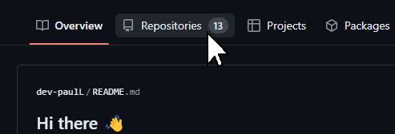
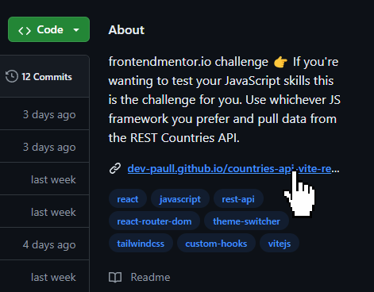

## Hi there 👋

I'm Paul, 24, a self-taught developer. This has been my hobby since I was very young, and after exploring various professional fields, I now wish to find a job in the software development sector. I have worked on several projects, including a native Android application, a digital flow meter with Arduino and various web integrations.

In recent weeks, I've been improving my front-end skills by taking [frontendmentor.io](https://www.frontendmentor.io/) challenges, and reading feedback on both my projects and others' projects on their official discord, or as replies to challenge submissions.

I learned **React** basics with my CountriesAPI project and plan to explore other frameworks as well before diving deeper into a particular one. I also plan to explore back-end development.

### Start exploring

  
How to check my projects

1. Click on Repositories 
2. Choose a project
3. Visit the live site 

